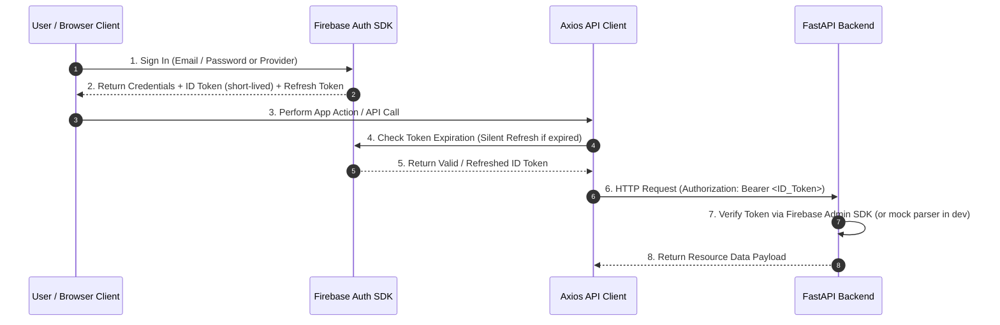

# PaperForge

**AI-Powered Research Workspace**

PaperForge helps researchers, students, and professionals understand, organize, compare, and synthesize research papers using Retrieval-Augmented Generation (RAG).

## Features

- 📄 **Upload & Parse** — Upload PDFs, DOCX, and text files with intelligent parsing
- 🗂️ **Collections** — Organize papers into named collections
- 💬 **Chat with Papers** — Ask questions about one or multiple papers
- 📝 **Citation-Aware Answers** — Every response includes source citations
- 🔍 **Semantic Search** — Find relevant content across your library
- 📊 **Paper Comparison** — Compare methodologies, findings, and conclusions
- 📚 **Literature Reviews** — Auto-generate literature review drafts
- 🧠 **Research Gaps** — Identify gaps and opportunities
- 📋 **Study Tools** — Generate notes, flashcards, and quizzes

---

## Architecture & Codebase Design

PaperForge follows **Clean Architecture** to maintain provider-independence, testability, and scalability.

```
   Presentation Layer (FastAPI Routes / React UI)
             ↓
   Application Layer (Use Cases: Upload, ProcessDocument)
             ↓
   Domain Service Layer (RetrievalService, VectorStoreService, EmbeddingService)
        ↙         ↘
   Domain Interfaces (VectorStore, EmbeddingProvider, CollectionManager)
        ↖         ↗
   Infrastructure Layer (ChromaVectorStore, GeminiEmbeddingProvider, Mock Providers)
```

### Key Modules Implemented

1. **Embedding Layer**:
   - **`EmbeddingProvider` (ABC)**: Abstract interface decoupling embedding generation from external vendors.
   - **`GeminiEmbeddingProvider`**: Concrete adapter utilizing LangChain and Google Gemini APIs.
   - **`MockEmbeddingProvider`**: Local offline testing adapter.
   - **`EmbeddingService`**: Manages validation limits, concurrency semaphores, and batch partitioning.

2. **Vector Store Layer**:
   - **`VectorStore` (ABC)**: Abstract interface isolating database drivers. Includes compatibility adapters to support legacy callers (e.g. `RAGChain` search).
   - **`ChromaVectorStore`**: Integrates with ChromaDB, maps database output arrays to clean domain results, and computes cosine similarity scores from L2/IP distances.
   - **`CollectionManager` (ABC)**: Isolated interface managing collection lifecycles (creation, deletion, stats) distinct from vector indexing.
   - **`VectorStoreService`**: Coordinates duplicates check, NaN checks, vector dimension checks, and write batching.

3. **Retrieval Layer**:
   - **`RetrievalService`**: Orchestrates the multi-stage grounding context retrieval pipeline:
     1. **Generate Embedding**: Generates the vector representation of the query.
     2. **Vector Search**: Queries similarity records using the extensible `MetadataFilter`.
     3. **Duplicate Removal**: Filters duplicate chunk IDs and semantically similar vector matches (cosine threshold).
     4. **Parent Merge Consolidation**: Groups adjacent child chunks pointing to a common parent, replacing them with the continuous parent context to improve readability.
     5. **Token Budgeting**: Packages chunks within the configured context window limit using character ratio estimators.
     6. **Retrieval Inspector**: Produces detailed diagnostic logs and rankings to power debugging panels.

---

## Tech Stack

| Layer | Technology |
|---|---|
| **Frontend** | React 19, TypeScript, Vite, Tailwind CSS, shadcn/ui |
| **Backend** | Python, FastAPI |
| **AI** | LangChain, Google Gemini API, Sentence Transformers |
| **Vector DB** | ChromaDB (swappable to Qdrant/Pinecone) |
| **Database** | SQLite (migratable to PostgreSQL) |
| **Document Processing** | PyMuPDF, python-docx |

---

## Quick Start

### Prerequisites

- Node.js 20+
- Python 3.11+
- Google API Key (for Gemini)

### Setup

```bash
# Clone and configure
cp .env.example .env
# Edit .env with your GOOGLE_API_KEY

# Backend Setup
cd server
python -m venv .venv
.venv\Scripts\activate  # Windows (or source .venv/bin/activate on Unix)
pip install -r requirements.txt
python -m app.main

# Frontend Setup (new terminal)
cd client
npm install
npm run dev
```


---

## Authentication & Token Refresh Strategy

PaperForge leverages Firebase Authentication for client-side identity management and backend token verification.

### Token Lifecycle & Silent Refresh



1. **Firebase**: User authenticates with Firebase Auth.
2. **ID Token**: Short-lived JWT generated by Firebase.
3. **Refresh Token**: Stored securely by the Firebase client SDK.
4. **Silent Refresh**: Axios interceptors request a fresh ID token transparently before sending requests.
5. **Axios**: Attaches current ID token to `Authorization: Bearer` request headers.
6. **FastAPI**: Validates token claims on every API route via `CurrentUser` dependency.

---

## Database Migration Workflow

Database schema evolution is managed explicitly through **Alembic** rather than startup runtime schema mutations.

### Contributor Workflow

```
Create migration  ──>  Review migration  ──>  Apply migration  ──>  Run tests  ──>  Deploy
```

1. **Create Migration**: Generate a new revision script after modifying SQLAlchemy ORM models.
   ```bash
   .venv\Scripts\alembic revision --autogenerate -m "describe_schema_change"
   ```
2. **Review Migration**: Inspect the generated file under `alembic/versions/` to verify table DDL statements.
3. **Apply Migration**: Execute schema changes cleanly using the helper CLI script.
   ```bash
   .venv\Scripts\python migrate.py upgrade head
   ```
4. **Run Tests**: Run test suite to verify data integrity and repository query contracts.
5. **Deploy**: Run `migrate.py upgrade head` in production deployment pipelines before launching app workers.

---

## Health Check & Diagnostics

PaperForge exposes a system health check endpoint for container probes, CI/CD pipelines, and infrastructure monitors.

**Endpoint**: `GET /health`

**Sample Response**:
```json
{
  "status": "healthy",
  "database": "connected",
  "firebase": "configured",
  "vector_store": "ready",
  "version": "1.0.0"
}
```

---

## Running the Test Suite

We use `pytest` for codebase verification. Run the test suite inside the `server` directory:

```bash
# Set PYTHONPATH and execute pytest
$env:PYTHONPATH="."
.venv\Scripts\pytest
```

The tests cover:
- **Chunking Service**: sliding windows, boundary checks, character limits.
- **Embedding Service**: batch processing, rate limiting, provider switching.
- **Vector Store Service**: batch insertions, NaN vector validation, dimension validations, workspace/metadata scoping filters.
- **Retrieval Service**: deduplication, parent chunk reconstruction, token limits, diagnostics.

